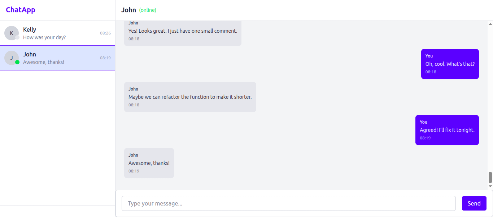
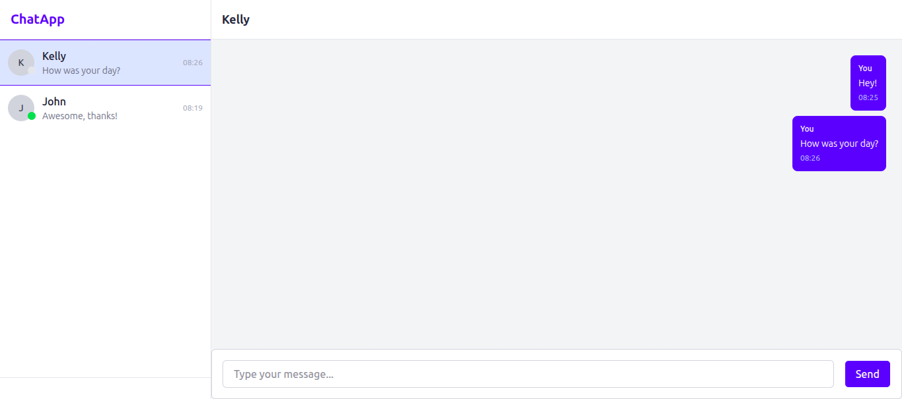

# Online Chat App

A real-time chat application built with React, Node.js, Express, PostgreSQL, and Socket.IO.

## 📸 Screenshots

### 🔐 SignUp & Login Pages

_Secure user authentication_

_Secure registration with input sanitization and password strength rules._

### 💬 Chat Interface

_Active chat panel showing message bubbles, auto-scroll, and send input._

_conversation list with online status indicator_

## ✨ Features

- User authentication with JWT and secure HttpOnly cookies
- Persistent login using refresh tokens
- Real-time messaging with instant delivery
- Online user presence indicator
- Responsive design with clean UI components
- Conversation list that updates in real time

## 🏆 Why This Backend Stands Out

This isn't just a CRUD app — it's a secure, well-architected REST API with:

- ✅ **RESTful Design**: Predictable endpoints, proper HTTP methods, clean resource modeling
- ✅ **Custom Validation Middleware**: Enforces business rules, prevents abuse, sanitizes input
- ✅ **Edge Case Coverage**: Handles expired tokens, forbidden access, duplicate emails, and more
- ✅ **Security First**: Uses HttpOnly cookies, JWT signing, bcrypt hashing, and role-based access control
- ✅ **Real-Time + REST Hybrid**: Messages saved securely via REST, then broadcasted via Socket.IO
- ✅ **Production-Ready Patterns**: Structured logging, error handling, database connection pooling

Built for scale, security, and maintainability.

## 🛠️ Tech Stack

**Frontend:**  
React, Vite, Tailwind CSS, Axios, Socket.IO Client, React Router

**Backend:**  
Node.js, Express, Socket.IO, PostgreSQL, pg

**Security:**  
bcrypt, JWT, CORS, Input validation, HttpOnly cookies

## 🚀 Installation & Setup

### Clone the repo

git clone https://github.com/MelikaRoshanaei/online-chat-app.git

### Install dependencies

cd online-chat-app
npm install

### Set up .env file (see .env.example)

### Run backend

node src/server.js

### Run frontend (in another terminal)

npm run dev

## 🚧 Upcoming Features

This app is actively being improved. Planned enhancements include:

- 🔤 **Message Edit & Delete**: Allow users to correct or remove messages
- 📎 **File & Image Sharing**: Support media uploads in conversations
- 🔍 **Search Messages**: Find past messages by keyword
- 🤖 **Typing Indicators**: Show when the other user is typing
- 🌙 **Dark Mode**: User preference for light/dark theme
- 👥 **Group Chats** (future): Expand from 1:1 to group messaging
- 🧑‍🤝‍🧑 **Contact Management** – Organize frequent contacts and block unwanted users
